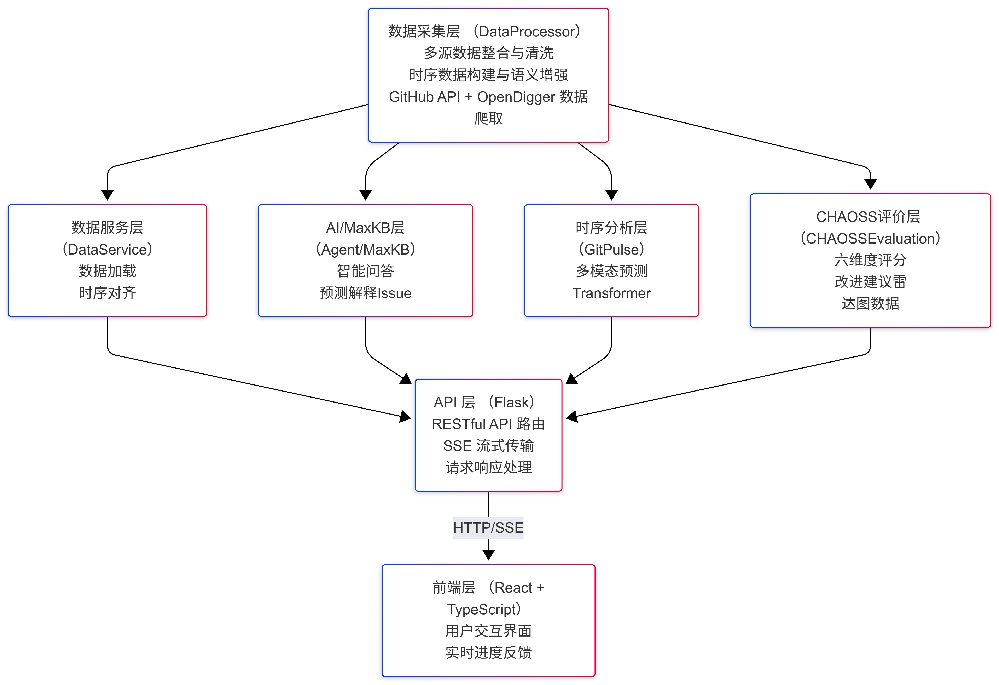
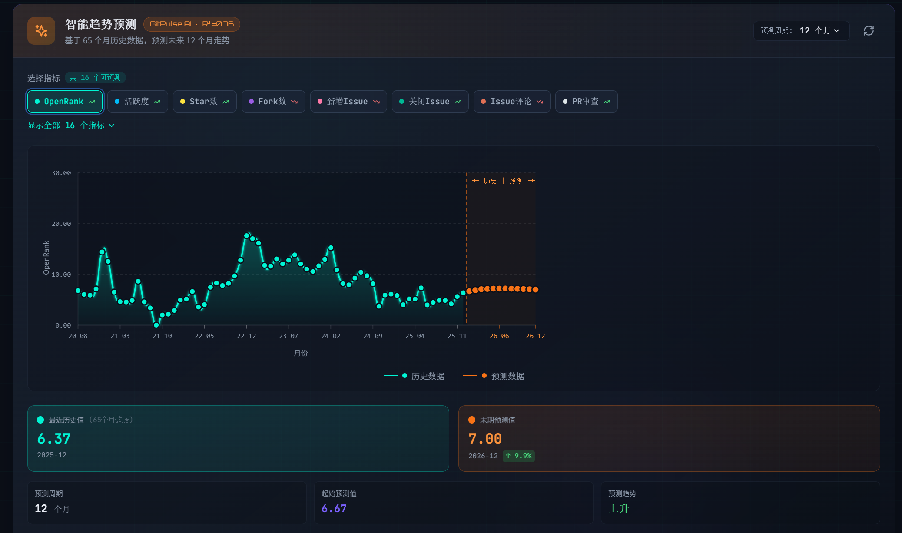

<div align="center">

# 🔮 OpenVista

### Multimodal Time-Series Prediction Platform for GitHub Repository Health


<br/>

[](https://www.python.org/)
[](https://reactjs.org/)
[](https://pytorch.org/)
[](https://www.typescriptlang.org/)
[](LICENSE)

**[English](README.md)** · **[中文文档](doc/README_CN.md)**

</div>

---

## 🌟 Overview

**OpenVista** is a next-generation platform for analyzing and predicting the health of open-source GitHub repositories. The platform integrates two core capabilities:

1. **🤖 MaxKB Intelligent Q&A System** — RAG-based knowledge base for project documentation
2. **🔮 GitPulse Multimodal Prediction Model** — Intelligent forecasting combining time-series and text

Together, these modules provide comprehensive analysis of open-source projects: past, present, and future.

---

### 💡 The Problem We're Solving

Open-source projects face numerous challenges in maintaining long-term health and sustainability. Our research, based on **4,232 GitHub repositories**, reveals critical gaps in how we understand and predict project health:

#### 🔴 Current Pain Points

1. **Fragmented Health Assessment**
   - Traditional metrics (Stars, Commits) provide only partial insights
   - No unified framework to evaluate project health holistically
   - Hard to identify early warning signs of declining projects

2. **Incomplete Prediction Models**
   - Existing approaches rely solely on time-series metrics (R² ≈ 0.46)
   - Ignore rich textual information (README, Issues, documentation)
   - Cannot capture semantic signals about project direction and community engagement

3. **High Collaboration Friction**
   - Poorly written Issues increase maintenance burden
   - Incomplete documentation barriers new contributors
   - Lack of structured guidance for improving project health

4. **Limited Actionable Insights**
   - Raw metrics don't translate to actionable recommendations
   - No systematic way to understand "why" a project is struggling
   - Difficult to discover similar projects for learning and collaboration

#### ✅ Our Solution

**OpenVista** addresses these challenges through three innovations:

1. **Multimodal Prediction** — Combining time-series metrics with textual features improves prediction accuracy by **66.7%** (R²: 0.46 → 0.77)
2. **CHAOSS-Based Health Scoring** — Six-dimensional framework providing comprehensive health assessment
3. **Intelligent Q&A** — RAG-powered knowledge base enabling natural language queries about any repository

Our platform transforms raw data into actionable intelligence, helping maintainers, contributors, and organizations make data-driven decisions about open-source projects.

---

## 📑 Table of Contents

- [🌟 Overview](#-overview)
  - [💡 The Problem We're Solving](#-the-problem-were-solving)
- [🛠️ Tech Stack](#️-tech-stack)
- [📁 Project Structure](#-project-structure)
- [🤖 MaxKB Intelligent Q&A System](#-maxkb-intelligent-qa-system)
  - [System Architecture](#system-architecture)
  - [Knowledge Base Contents](#knowledge-base-contents)
  - [Deployment & Configuration](#deployment--configuration)
- [🔬 GitPulse Prediction Model](#-gitpulse-prediction-model)
  - [Model Performance](#model-performance)
  - [Model Overview](#model-overview)
  - [Architecture Highlights](#architecture-highlights)
  - [Two-Stage Training](#two-stage-training)
  - [Reproducing GitPulse Model](#reproducing-gitpulse-model)
- [✨ Feature Gallery](#-feature-gallery)
- [🚀 Quick Start](#-quick-start)
- [📖 Usage Guide](#-usage-guide)
- [🤝 Contributing](#-contributing)
- [📄 License](#-license)
- [📢 Community Initiative](#-community-initiative)
- [🙏 Acknowledgments](#-acknowledgments)

---

## 🛠️ Tech Stack

<div align="center">

</div>

<table>
<tr>
<td width="50%">

### Backend
- **Framework**: Flask (Python)
- **Deep Learning**: PyTorch 2.0+
- **NLP**: Transformers (DistilBERT)
- **Data Processing**: Pandas, NumPy

</td>
<td width="50%">

### Frontend
- **Framework**: React 18+ with TypeScript
- **Styling**: Tailwind CSS
- **Charts**: Recharts + Custom SVG
- **Animation**: Framer Motion

</td>
</tr>
<tr>
<td>

### AI & Knowledge Base
- **RAG System**: MaxKB
- **LLM Backup**: DeepSeek API
- **Text Encoding**: DistilBERT

</td>
<td>

### Data Sources
- **GitHub API**: Issues, PRs, Commits
- **OpenDigger**: 16 time-series metrics

</td>
</tr>
</table>

---

## 📁 Project Structure

```
OpenVista/
├── 🔧 backend/                     # Flask Backend
│   ├── Agent/                      # AI & MaxKB Integration
│   │   ├── maxkb_client.py         # MaxKB Knowledge Base Client
│   │   ├── prediction_explainer.py # AI Prediction Explainer
│   │   └── qa_agent.py             # Intelligent Q&A Agent
│   │
│   ├── DataProcessor/              # Data Crawling & Processing
│   │   ├── crawl_monthly_data.py   # Main Crawler Entry
│   │   ├── github_text_crawler.py  # GitHub Text Crawler
│   │   ├── maxkb_uploader.py       # MaxKB Document Uploader
│   │   └── monthly_crawler.py      # OpenDigger Data Crawler
│   │
│   ├── GitPulse/                   # GitPulse Prediction Model
│   │   ├── model.py                # Model Architecture
│   │   ├── prediction_service.py   # Prediction Service
│   │   └── gitpulse_weights.pt     # Trained Model Weights (LFS)
│   │
│   ├── CHAOSSEvaluation/           # Community Health Scoring
│   │   └── chaoss_calculator.py    # CHAOSS Metric Calculator
│   │
│   └── app.py                      # Flask API Entry Point
│
├── 🎨 frontend/                    # React Frontend
│
├── 📊 get-dataset/                 # Training Dataset Generator
│
├── 🔬 GitPulse-Training/          # GitPulse Model Training & Reproduction
│   ├── model/                     # Model Architecture Definitions
│   ├── training/                  # Training Scripts
│   ├── Fine-tuning/               # Fine-tuning Experiments
│   ├── predict/                   # Prediction Scripts
│   ├── ablation-test/             # Ablation Studies
│   ├── baseline-test/             # Baseline Comparisons
│   └── Pretrain-data/             # Training Dataset
│
├── 🐳 maxkb-export/                # MaxKB Deployment Config
│   ├── install.sh                  # One-click Install Script
│   ├── docker-compose.yml          # Docker Compose File
│   └── db/                         # Database Backup
│
└── 📄 README.md
```

---

## 🤖 MaxKB Intelligent Q&A System

<div align="center">

</div>

### System Architecture

MaxKB is the **AI Q&A core** of OpenVista, using **RAG (Retrieval-Augmented Generation)** technology to enable natural language questions about any analyzed repository.

```
User Question → MaxKB Retrieves from Knowledge Base → LLM Generates Answer → Response
```

### Knowledge Base Contents

The system automatically builds a knowledge base for each analyzed repository:

| Document Type | Description |
|---------------|-------------|
| 📄 **README** | Project introduction, installation guide, usage instructions |
| 📜 **LICENSE** | Open source license information |
| 📁 **docs/** | All documents in the project's docs directory |
| 📊 **Project Summary** | AI-generated project analysis report |
| 🐛 **Issue Summary** | Sampled issue data (30 issues/month × 50 months max) |

### Tech Stack & Tools

| Component | Tool/Technology | Description |
|-----------|-----------------|-------------|
| **Knowledge Base Platform** | [MaxKB](https://github.com/1Panel-dev/MaxKB) | Open-source RAG knowledge base system |
| **Deployment** | Docker Compose | One-click deployment with data persistence |
| **Vector Database** | PostgreSQL + pgvector | Efficient vector similarity search |
| **LLM Backend** | Configurable (DeepSeek/OpenAI etc.) | Supports multiple LLM providers |

### Deployment & Configuration

#### Option 1: Use Pre-configured Knowledge Base (Recommended)

```bash
cd maxkb-export

# One-click install (includes database backup restoration)
chmod +x install.sh
./install.sh
```

The installation script will automatically:
- Pull MaxKB Docker image
- Create data volumes and restore pre-configured data
- Start service at `http://localhost:8080`

#### Option 2: Fresh Installation

```bash
# Start with Docker Compose
docker-compose -f docker-compose.maxkb.yml up -d
```

#### Configure .env File

```env
# MaxKB Service Configuration
MAXKB_URL=http://localhost:8080
MAXKB_USERNAME=admin
MAXKB_PASSWORD=your_password
MAXKB_KNOWLEDGE_ID=your_knowledge_id

# MaxKB AI API (for Q&A)
MAXKB_AI_URL=http://localhost:8080/api/application/{app_id}/chat/completions
MAXKB_API_KEY=your_maxkb_api_key
```

### Usage

1. **Automatic Document Upload**: Documents are automatically uploaded to MaxKB during repository crawling
2. **Intelligent Q&A**: Ask questions in the platform's AI Q&A module
3. **Prediction Explanations**: MaxKB generates interpretability analysis for predictions

<div align="center">

</div>

---

## 🔬 GitPulse Prediction Model

### Model Performance

<div align="center">

</div>

Evaluated on **636 test samples** from **4,232 GitHub projects** (Two-stage training: Pretrain + Fine-tune):

<div align="center">

| Model | MSE ↓ | MAE ↓ | R² ↑ | DA ↑ | TA@0.2 ↑ |
|:------|:-----:|:-----:|:----:|:----:|:--------:|
| **GitPulse (Transformer+Text)** | **0.0712** | **0.1075** | **0.77** | **73.00%** | **81.75%** |
| CondGRU+Text | 0.0949 | 0.1243 | 0.69 | 68.56% | 79.55% |
| GRU+Text | 0.1084 | 0.1297 | 0.65 | 68.28% | 79.12% |
| Transformer | 0.1693 | 0.1667 | 0.46 | 62.22% | 75.97% |
| CondGRU | 0.1961 | 0.1872 | 0.44 | 61.49% | 74.39% |
| LSTM | 0.2142 | 0.1914 | 0.46 | 56.00% | 75.00% |
| MLP | 0.2280 | 0.2025 | 0.34 | 56.00% | 73.00% |
| Linear | 0.2261 | 0.1896 | 0.34 | 53.00% | 74.00% |

</div>

> **Text Contribution**: Adding text features improves R² from 0.46 → 0.77 (**+66.7%**)

### Model Overview

**GitPulse** is OpenVista's core multimodal time-series prediction model, capable of simultaneously forecasting 16 OpenDigger metrics.

<div align="center">

</div>

### Architecture Highlights

| Component | Technology | Purpose |
|-----------|------------|---------|
| **Time-Series Encoder** | Transformer (2 layers, 4 heads) | Captures temporal patterns across 16 metrics |
| **Text Encoder** | DistilBERT (frozen) + Attention Pooling | Extracts features from project descriptions |
| **Fusion Layer** | Cross-Attention + Dynamic Gating (0.1-0.3) | Text-guided temporal feature fusion |
| **Auxiliary Tasks** | Contrastive Learning + Matching | Improves text-timeseries alignment |
| **Prediction Head** | MLP + Time Projection | Outputs predictions for 32 months ahead |

<details>
<summary>📈 Click to see text contribution effect</summary>

<div align="center">

</div>

</details>

### Model Parameters

| Parameter | Value | Description |
|-----------|-------|-------------|
| d_model | 128 | Model hidden dimension |
| n_heads | 4 | Multi-head attention heads |
| n_layers | 2 | Transformer encoder layers |
| hist_len | 128 months | Historical input length |
| pred_len | 32 months | Prediction horizon |
| n_vars | 16 | Number of metrics |
| text_weight | 0.1-0.3 | Dynamic text contribution |

### Two-Stage Training

1. **Pretraining**: Multi-task learning with MSE + Contrastive Loss (λ=0.1) + Matching Loss (λ=0.05)
2. **Fine-tuning**: Full parameter fine-tuning with lower learning rate (1e-5)

### Supported Metrics (16 total)

| Category | Metrics |
|----------|---------|
| **Popularity** | OpenRank, Stars, Forks, Attention |
| **Activity** | Activity, Participants, New Contributors |
| **Contributors** | Contributors, Inactive Contributors, Bus Factor |
| **Issues** | New Issues, Closed Issues, Issue Comments |
| **Pull Requests** | Change Requests, PR Accepted, PR Reviews |

### Training Your Own Model

```bash
cd get-dataset

# Generate dataset (default: 10,000 repos)
python generate_training_dataset.py --count 10000

# Resume from interruption
python generate_training_dataset.py --resume
```

See [get-dataset/README.md](get-dataset/README.md) for detailed options.

### Reproducing GitPulse Model

We provide a complete training repository `GitPulse-Training/` for reproducing the GitPulse model from scratch.

#### Quick Start

```bash
cd GitPulse-Training

# Install dependencies
pip install -r requirements.txt

# Train the model (two-stage training)
cd training
python train_multimodal_v4_1.py --epochs 100 --batch_size 8

# Fine-tuning (for best performance)
cd ../Fine-tuning
python finetune_all_v4_1.py \
    --pretrained_checkpoint ../training/checkpoints/best_model_transformer_mm.pt \
    --strategy full \
    --epochs 50 \
    --batch_size 8 \
    --lr 1e-5
```

#### Directory Structure

```
GitPulse-Training/
├── model/                          # Model architecture definitions
│   └── multimodal_ts_v4_1.py      # Transformer+Text model
├── training/                       # Training scripts
│   ├── train_multimodal_v4_1.py   # Main training script
│   └── checkpoints/               # Saved model weights
├── Fine-tuning/                   # Fine-tuning experiments
│   └── results/                   # Fine-tuned models
├── predict/                       # Prediction scripts
│   └── predict_single_repo.py    # Single repository prediction
├── ablation-test/                 # Ablation studies
├── baseline-test/                 # Baseline comparisons
├── merge-test/                    # Fusion method comparisons
├── Pretrain-data/                 # Training dataset
│   └── github_multivar.json      # Multi-variable time-series data
├── evaluate_all_models.py         # Unified evaluation script
└── README.md                      # Detailed training guide
```

#### Key Features

- **Two-Stage Training**: Pretraining with multi-task learning + full parameter fine-tuning
- **Complete Experiments**: Ablation studies, baseline comparisons, fusion method tests
- **Unified Evaluation**: Single script to evaluate all models with comprehensive metrics
- **Production Ready**: Includes prediction scripts for real-world usage

For detailed training instructions, model architecture, and experiment results, see [GitPulse-Training/README.md](GitPulse-Training/README.md).

---

## ✨ Feature Gallery

### Key Features

| Feature | Description |
|---------|-------------|
| 🤖 **MaxKB AI Q&A** | RAG-powered knowledge base Q&A for project documentation |
| 🔮 **GitPulse Prediction** | Time-series + text embeddings, forecasting up to 32 months |
| 📊 **CHAOSS Evaluation** | Community health assessment with 6-dimension radar visualization |
| 🔍 **Similar Repo Discovery** | Find related projects via GitHub API-based similarity matching |
| 📈 **Interactive Visualization** | Beautiful charts with 60+ months historical data comparison |
| ⚡ **Real-time Crawling** | Fetch any GitHub repository data on demand |

<details>
<summary><b>🔮 Intelligent Prediction</b> - 12-month forecasting with historical comparison</summary>

<div align="center">

</div>

**AI-Powered Prediction Explanation:**

<div align="center">

</div>

</details>

<details>
<summary><b>📊 Time-Series Visualization</b> - Multi-dimensional metric analysis</summary>

<div align="center">

</div>

</details>

<details>
<summary><b>🏥 CHAOSS Health Evaluation</b> - 6-dimension radar chart analysis</summary>

<div align="center">

</div>

</details>

<details>
<summary><b>🤖 AI Smart Summary</b> - Project analysis with similar repo recommendations</summary>

<div align="center">

</div>

</details>

<details>
<summary><b>🐛 Issue Analysis</b> - Intelligent classification and trend analysis</summary>

<div align="center">

</div>

**Classification Statistics:**

<div align="center">

</div>

</details>

<details>
<summary><b>📖 Built-in Documentation</b> - Technical documentation and API reference</summary>

<div align="center">

</div>

</details>

---

## 🚀 Quick Start

### Prerequisites

- Python 3.8+
- Node.js 16+
- Docker Desktop (for MaxKB)
- Git (Git LFS auto-installed)

### 🎯 One-Click Setup (Recommended)

We provide unified setup scripts that automate all configuration:

**Windows PowerShell:**
```powershell
git clone https://github.com/your-username/OpenVista.git
cd OpenVista
.\setup.ps1
```

**Linux / macOS:**
```bash
git clone https://github.com/your-username/OpenVista.git
cd OpenVista
chmod +x setup.sh && ./setup.sh
```

The setup script will automatically:

| Step | Description |
|------|-------------|
| 📦 Git LFS | Pull model weights, training data, knowledge base |
| 🐳 Docker | Detect installation, guide setup if needed |
| 🤖 MaxKB | Deploy knowledge base, auto-restore data |
| 🔑 API Keys | Configure GitHub Token & DeepSeek API Key |
| 📚 Dependencies | Optional Python/Node.js installation |
| 🚀 Launch Services | Auto-start backend, frontend, open browser |

---

### 📖 Manual Installation (Advanced)

<details>
<summary>Click to expand manual steps</summary>

#### 1️⃣ Clone & Initialize

```bash
git clone https://github.com/your-username/OpenVista.git
cd OpenVista

# Pull large files (model weights, training data)
git lfs install
git lfs pull
```

#### 2️⃣ Deploy MaxKB

```bash
cd maxkb-export
chmod +x install.sh
./install.sh  # Windows: .\install.ps1
```

Visit `http://localhost:8080` to verify MaxKB is running.

#### 3️⃣ Environment Configuration

Create a `.env` file in the `backend/` directory:

```env
# GitHub API Token (required)
GITHUB_TOKEN=your_github_token

# DeepSeek API Key (for AI features)
DEEPSEEK_API_KEY=your_deepseek_key
```

#### 4️⃣ Install Dependencies

```bash
# Backend
cd backend
pip install -r requirements.txt

# Frontend
cd ../frontend
npm install
```

</details>

---

### 🚀 Launch Services

```bash
# Terminal 1: Start Backend (port 5001)
cd backend
python app.py

# Terminal 2: Start Frontend (port 5173)
cd frontend
npm run dev
```

### 🌐 Access the Platform

| Service | URL |
|---------|-----|
| Frontend | http://localhost:5173 |
| Backend API | http://localhost:5001 |
| MaxKB Knowledge Base | http://localhost:8080 |

---

## 📖 Usage Guide

### Basic Workflow

1. **🔍 Search Repository** — Enter `owner/repo` (e.g., `facebook/react`)
2. **⏳ Wait for Crawling** — Data fetched from GitHub API & OpenDigger
3. **📊 Explore Analytics** — View time-series charts, Issue analysis
4. **🔮 Check Predictions** — See 12-month forecasts with AI explanations
5. **📈 CHAOSS Evaluation** — Assess community health scores
6. **🤖 AI Q&A** — Use MaxKB to ask questions about the repository

---

## 🤝 Contributing

We welcome contributions! Please follow these steps:

1. Fork the repository
2. Create a feature branch (`git checkout -b feature/AmazingFeature`)
3. Commit changes (`git commit -m 'Add AmazingFeature'`)
4. Push to branch (`git push origin feature/AmazingFeature`)
5. Open a Pull Request

---

## 📄 License

This project is licensed under the **MIT License**. See [LICENSE](LICENSE) for details.

---

## 📢 Community Initiative

Based on our research findings, we have published a **Community Practice Initiative** that calls for the open-source ecosystem to prioritize text information quality (documentation, Issue descriptions, etc.) as a core component of project governance.

**Key Message**: Well-written documentation and structured Issue templates are not optional—they are essential for project sustainability and, in the AI era, critical for lowering contribution barriers. When combined with AI technologies (RAG-based Q&A, intelligent code assistants), high-quality text information can dramatically reduce the onboarding cost for new contributors.

📖 **Read the full initiative**: [doc/倡议书/倡议书.md](doc/倡议书/倡议书.md) (Chinese)

The initiative includes:
- Empirical findings from 600+ GitHub projects
- Practical recommendations for maintainers, contributors, organizations, and platform developers
- Emphasis on AI-assisted collaboration and knowledge management

---

## 🙏 Acknowledgments

- [MaxKB](https://github.com/1Panel-dev/MaxKB) — RAG Knowledge Base System
- [OpenDigger](https://github.com/X-lab2017/open-digger) — Time-series metrics data
- [CHAOSS](https://chaoss.community/) — Community health metrics framework
- [GitHub API](https://docs.github.com/en/rest) — Repository data source

---

<div align="center">

### ⭐ Star this repo if you find it useful! ⭐

<br/>

**Made with ❤️ by the OpenVista Team**

*Empowering open-source with predictive intelligence*

</div>
