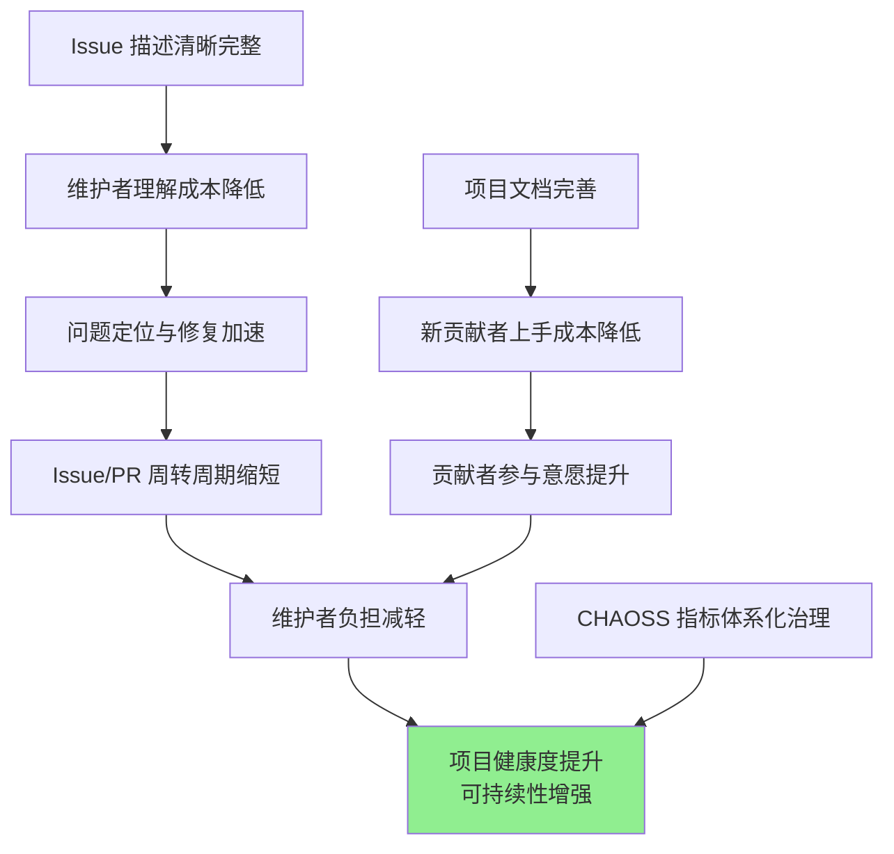

# 面向开源生态的实践倡议

**—— 基于 OpenVista 项目的数据分析与思考**

---

## 摘要

本倡议基于 OpenVista 项目在 4,232 个 GitHub 项目上的实证研究，探讨文本信息质量（Issue 描述、项目文档等）对开源项目健康度的影响。研究发现，融合文本特征后，项目健康度预测模型的 R² 从 0.46 提升至 0.77（+66.7%），表明高质量的文本信息对项目的可理解性、协作效率和长期可持续性具有显著正向作用。

基于上述发现，我们向开源社区的维护者、贡献者、组织机构和平台开发者提出若干实践建议，旨在推动"可理解、可协作、可持续"成为开源生态的共识。

---

## 一、研究背景

开源项目的价值不仅源于代码本身，更依赖于围绕代码形成的协作网络。然而，我们在实践中观察到，大量协作摩擦来自两个看似细小却高频发生的环节：

1. **Issue 表达不充分**：复现信息缺失、上下文不足、标题缺乏可检索性，导致维护者需要反复追问，增加沟通成本。

2. **项目描述与文档不完善**：新贡献者难以快速理解项目定位、技术架构和贡献流程，形成"有意愿但难以入手"的困境。

这些摩擦的累积效应会逐步反映在项目的健康度指标上：活跃度下降、贡献者流失、Issue/PR 周转效率降低等。

---

## 二、研究方法与数据

### 2.1 数据集

我们基于 OpenDigger 和 GitHub API 构建了包含 **4,232 个 GitHub 项目** 的数据集，涵盖前端框架、后端服务、工具库、机器学习等多种类型。

| 数据维度 | 规模 |
|----------|------|
| 项目总数 | 4,232 个 |
| 时序指标 | 16 个（OpenDigger 标准指标） |
| 历史跨度 | 128 个月 |
| 预测跨度 | 32 个月 |
| 测试样本 | 636 个（15% 划分） |

### 2.2 模型架构

我们构建了 **GitPulse** 多模态时序预测模型，采用 Transformer 编码器处理时序数据，DistilBERT 提取文本语义特征，通过交叉注意力机制实现两种模态的融合。

模型采用两阶段训练策略：
- **预训练阶段**：多任务学习（预测损失 + 对比学习 + 匹配任务）
- **微调阶段**：全参数微调，学习率 1e-5

### 2.3 评估指标

| 指标 | 含义 |
|------|------|
| MSE | 均方误差，越低越好 |
| R² | 决定系数，模型解释力，越高越好 |
| DA | 方向准确率，预测涨跌方向的正确率 |
| TA@0.2 | 阈值准确率，预测误差在 0.2 以内的比例 |

---

## 三、主要发现

### 3.1 文本信息对预测的显著贡献

<div align="center">

<p><i>图 1：不同预测方法在测试集上的性能对比</i></p>
</div>

| 模型 | MSE ↓ | R² ↑ | DA ↑ | TA@0.2 ↑ |
|:-----|:-----:|:----:|:----:|:--------:|
| **GitPulse (Transformer+Text)** | **0.0712** | **0.77** | **73.0%** | **81.8%** |
| CondGRU+Text | 0.0949 | 0.69 | 68.6% | 79.6% |
| GRU+Text | 0.1084 | 0.65 | 68.3% | 79.1% |
| Transformer（纯时序） | 0.1693 | 0.46 | 62.2% | 76.0% |
| LSTM | 0.2142 | 0.46 | 56.0% | 75.0% |
| Linear | 0.2261 | 0.34 | 53.0% | 74.0% |

**核心发现**：加入文本特征后，模型 R² 从 0.46 提升至 0.77，提升幅度达 **66.7%**。这一结果表明，项目的文本信息（描述、Issue、README 等）包含了对健康度预测有显著价值的语义信息。

<div align="center">

<p><i>图 2：时序特征与文本特征融合的效果对比</i></p>
</div>

### 3.2 四项关键结论

基于上述实验结果，我们总结出以下四项关键结论：

**结论一：有效的文本信息对项目健康度预测具有正向促进作用**

文本特征（项目描述、Issue 内容、Commit 信息等）能够捕捉时序指标难以反映的语义信息，如项目定位的清晰度、问题描述的完整性、社区讨论的质量等。这些因素与项目的长期发展轨迹密切相关。

**结论二：项目描述性文本能有效降低协作门槛**

清晰的 README、完善的贡献指南、结构化的文档，不仅提升模型的预测能力，更重要的是降低了新贡献者的认知负担，使"理解项目"和"参与贡献"变得更加容易。

**结论三：CHAOSS 指标体系提供了更全面的健康度视角**

单一指标（如 Star 数、Commit 数）往往具有片面性。CHAOSS 指标体系从活跃度、贡献者结构、响应效率、社区多样性等多个维度评估项目健康状况，为项目治理提供了结构化的参照框架。

<div align="center">

<p><i>图 3：基于 CHAOSS 的多维健康度评估</i></p>
</div>

**结论四：Issue 维护质量影响项目的可持续性**

Issue 的关闭效率、讨论质量、标签体系完善程度、重复问题的治理水平等，会在长期趋势中逐步体现。维护良好的 Issue 系统是项目可持续发展的重要基础。

---

## 四、影响机制分析

文本质量影响项目健康度的机制可以概括为以下路径：



核心逻辑是：**清晰的表达 → 高效的沟通 → 降低的协作成本 → 更好的可持续性**。

---

## 五、实践建议

基于上述研究发现，我们向开源生态的不同参与者提出以下建议：

### 5.1 面向项目维护者

**Issue 管理**

| 实践项 | 具体建议 |
|--------|----------|
| Issue 模板 | 启用结构化模板，包含问题描述、复现步骤、环境信息、期望/实际结果等必填字段 |
| 标签体系 | 建立 `type/*`（类型）、`area/*`（模块）、`priority/*`（优先级）等分类标签 |
| 标题规范 | 建议采用"问题现象 + 影响范围 + 版本/模块"的格式，提升可检索性 |
| 响应机制 | 明确响应周期预期，即使是"尽力而为"的说明也能降低社区不确定性 |

**Issue 模板示例**：

```markdown
### 问题描述
<!-- 请简要描述遇到的问题 -->

### 复现步骤
1. 
2. 
3. 

### 期望结果


### 实际结果


### 环境信息
- 操作系统：
- 运行时版本：
- 项目版本：

### 相关日志
<!-- 请使用代码块格式 -->
```

**文档建设**

| 文档类型 | 应包含内容 |
|----------|------------|
| README | 项目定位、快速开始、基本用法、贡献入口 |
| CONTRIBUTING | PR 流程、代码规范、测试要求、Review 流程 |
| 架构文档 | 系统设计、模块划分、技术选型说明 |
| FAQ | 常见问题汇总，减少重复提问 |

### 5.2 面向贡献者

| 场景 | 建议实践 |
|------|----------|
| 提交 Issue 前 | 搜索已有 Issue 避免重复；尝试最新版本复现；准备完整的环境信息 |
| 描述问题时 | 提供最小化复现步骤；使用代码块格式贴日志；区分"事实"与"推测" |
| 参与讨论时 | 解决问题后回馈解决方案；协助标注重复 Issue；参与 FAQ 整理 |

### 5.3 面向组织与基金会

| 方向 | 建议措施 |
|------|----------|
| 激励机制 | 将文档质量、Issue 响应效率纳入项目评估维度 |
| 资源支持 | 为维护者提供 Issue triage、社区运营等方面的支持 |
| 标准推广 | 推动 CHAOSS 等健康度指标的采集与公开 |

### 5.4 面向平台与工具开发者

| 方向 | 建议措施 |
|------|----------|
| 智能辅助 | 提供 Issue 模板推荐、相似问题提示、环境信息自动采集等功能 |
| 知识管理 | 支持将 Issue/文档沉淀为可检索知识库，提升知识复用率 |

---

## 六、研究局限性

为确保研究结论的正确理解，我们需要说明以下局限性：

### 6.1 Issue 分析为抽样方式

OpenVista 的 Issue 分析采用抽样策略：每月最多抽取 30 条 Issue，最多覆盖 50 个月。这一设计用于发现趋势和模式，而非穷尽统计。

### 6.2 预测模型的适用边界

尽管模型 R² 达到 0.77，但时序预测本身具有不确定性。模型更适合用于：
- 趋势洞察与模式发现
- 项目间的相对比较
- 辅助决策而非替代决策

### 6.3 相关性与因果性

本研究发现了"文本质量"与"项目健康度"之间的相关性，但因果关系的确立需要更多控制实验和纵向研究。可能存在第三因素（如团队能力、资源投入）同时影响两者。

---

## 七、后续工作

OpenVista 项目组将持续推进以下工作：

1. **开放研究资源**：`GitPulse-Training/` 目录包含完整的模型训练代码和数据处理流程，支持实验复现。

2. **扩展验证范围**：在更多项目类型、更长时间跨度上验证研究结论的普适性。

3. **社区协作**：欢迎通过 Issue 或 PR 参与讨论，共同完善实践建议。

---

## 八、结语

开源生态的繁荣不仅依赖代码的共享，更依赖高效的协作。Issue、文档、讨论等"软性基础设施"的质量，直接影响着协作成本和项目的可持续性。

我们期望通过本研究的发现，推动开源社区更加重视"可理解性"和"可协作性"的建设。当沟通成本降低，贡献门槛下降，整个生态将获得更强的活力与韧性。

---

<div align="center">

**请求响应队**

2026 年 1 月

</div>

---

## 附录：数据来源与引用

| 数据项 | 来源 | 说明 |
|--------|------|------|
| 时序指标数据 | OpenDigger | 16 个标准化指标 |
| 项目元数据 | GitHub API | 描述、主题、README 等 |
| 评估结果 | GitPulse 训练产出 | 详见 `GitPulse-Training/evaluation_results.json` |

### 16 个时序指标说明

| 序号 | 指标名称 | 含义 |
|:----:|----------|------|
| 1 | OpenRank | 项目影响力指数 |
| 2 | Activity | 综合活跃度评分 |
| 3 | Stars | 当月新增 Star 数 |
| 4 | Forks | 当月新增 Fork 数 |
| 5 | Attention | 关注者增量 |
| 6 | Participants | 活跃参与者数 |
| 7 | New Contributors | 新增贡献者数 |
| 8 | Contributors | 活跃贡献者数 |
| 9 | Inactive Contributors | 不活跃贡献者数 |
| 10 | Bus Factor | 项目风险指标 |
| 11 | Issues New | 新开 Issue 数 |
| 12 | Issues Closed | 关闭 Issue 数 |
| 13 | Issue Comments | Issue 评论数 |
| 14 | Change Requests | PR 数量 |
| 15 | Change Requests Accepted | 合并 PR 数 |
| 16 | Change Requests Reviews | PR 审查数 |
