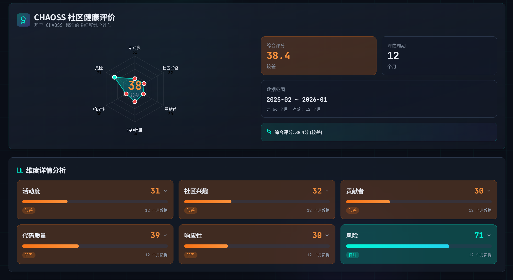

# 面向开源生态的实践倡议

**—— 基于 OpenVista 项目的数据分析与思考**

---

## 摘要

我们分析了 600+ 个 GitHub 项目，发现一个事实：项目的文本信息质量（Issue 描述、README、文档等）与项目健康度存在强关联。当我们将文本特征纳入预测模型后，准确率提升了 66.7%（R² 从 0.46 提升至 0.77）。这一发现意味着，那些看似"软性"的文本工作，实际上对项目的长期发展具有决定性影响。

我们希望通过这份倡议，让更多开源社区意识到：写好文档、规范 Issue、完善描述，不是可选项，而是项目可持续发展的必要保障。当整个生态都重视这些"软性基础设施"时，开源协作将变得更加高效，项目将获得更强的生命力。

---

## 一、问题的根源：被忽视的协作成本

开源项目的成功，不仅仅是代码写得好。决定一个项目能否长期发展的，是**围绕代码形成的协作网络是否健康**。然而，在 600+ 个项目的分析中，我们发现大量项目正在因为一些看似细小的问题而逐渐失去活力。

最常见的情况是：一个维护者打开 Issue，看到的是"这个功能不工作"这样模糊的描述，需要花时间追问环境信息、复现步骤、错误日志。一个潜在贡献者点进项目，README 只有一行"这是一个很棒的项目"，他需要自己摸索项目定位、安装方法、贡献流程。这些看似微小的摩擦，每天都在成千上万个项目中重复发生，累积起来就是巨大的协作成本。

更严重的是，当维护者因为沟通成本过高而逐渐失去响应热情，当新贡献者因为上手门槛太高而选择放弃，这些项目的健康度指标就会开始下滑：活跃度下降、贡献者流失、Issue 堆积、PR 周转变慢。我们的数据显示，那些文本信息质量较低的项目，在长期趋势中更容易出现这些衰退信号。

问题的根源在于，我们长期以来将"写好文档"视为锦上添花，而非项目治理的核心环节。Star 数、Commit 数这些硬指标更容易被关注，而 Issue 质量、文档完整性这些软指标却往往被忽视。但数据告诉我们，这些软指标恰恰是预测项目健康度的关键信号。

---

## 二、数据告诉我们什么

我们在 600+ 个 GitHub 项目上进行了大规模分析，涵盖前端框架、后端服务、工具库、机器学习等各个领域，时间跨度最长超过 10 年。当我们尝试预测这些项目的健康度时，发现了一个令人意外的结果：仅使用传统的时序指标（Star 数、Commit 数、PR 数等），模型的解释力只有 46%。但当我们加入项目的文本信息（README、Issue 描述、文档内容）后，解释力跃升至 77%，提升了 66.7%。

---

这个数字背后意味着什么？意味着项目的文本信息包含了大量时序指标无法捕捉的语义信号。更重要的是，这些文本信息的作用远不止于帮助我们预测项目健康度。在 AI 技术快速发展的今天，README、文档、Issue 描述等文本内容，正在成为降低开发贡献门槛的关键工具。当项目拥有清晰的结构化文档时，AI 助手可以快速理解项目定位、技术架构和使用方法，从而帮助新贡献者更快上手。

当 Issue 描述包含完整的上下文信息时，AI 可以自动提取关键信息、推荐相似问题、生成解决方案建议，大幅降低维护者的处理成本。当文档体系完善时，基于 RAG 技术的智能问答系统可以让任何人通过自然语言快速获取项目知识，而不需要花费大量时间阅读冗长的文档。这些看似主观的因素，实际上能够显著影响项目的协作效率和社区参与度，进而影响项目的长期发展轨迹。

<i>图 1：不同预测方法在测试集上的性能对比</i>

<i>图 2：时序特征与文本特征融合的效果对比</i>

进一步的分析显示，那些拥有清晰 README、完善贡献指南、结构化文档的项目，不仅在我们的预测模型中得分更高，更重要的是，它们在实际运行中确实表现出更强的生命力：新贡献者更容易上手，Issue 处理效率更高，社区讨论质量更好，项目维护者的负担更轻。特别是在 AI 技术日益普及的今天，这些结构化的文本信息正在发挥更大的作用。当项目文档清晰完整时，AI 代码助手可以更好地理解项目上下文，为新贡献者提供准确的代码建议和问题解答。

当 Issue 描述规范详细时，AI 可以自动分类、提取关键信息、推荐解决方案，让维护者能够更高效地处理问题。当文档体系完善时，基于 RAG 的智能问答系统可以让任何人通过自然语言快速获取所需信息，而不需要花费大量时间在文档中搜索。相反，那些文档简陋、Issue 描述模糊的项目，即使代码质量不错，也更容易陷入"有意愿但难以参与"的困境，因为无论是人类贡献者还是 AI 助手，都难以从零散的文本中提取有效信息，最终导致贡献者流失和项目衰退。

我们还发现，单一指标（如 Star 数）往往具有欺骗性。一个项目可能因为某个热点事件而获得大量 Star，但如果没有良好的协作机制和文档支持，这些关注度很难转化为持续的贡献。CHAOSS 指标体系从活跃度、贡献者结构、响应效率、社区多样性等多个维度评估项目，为我们提供了更全面的视角。那些在各个维度都表现均衡的项目，往往具有更强的抗风险能力和可持续发展潜力。

<i>图 3：基于 CHAOSS 的多维健康度评估</i>

特别值得注意的是，Issue 维护质量对项目可持续性的影响。那些建立了完善 Issue 模板、标签体系、响应机制的项目，不仅能够更高效地处理问题，更重要的是，它们向社区传递了"这个项目被认真维护"的信号，从而吸引更多高质量的贡献。而那些 Issue 堆积、响应缓慢、标签混乱的项目，即使代码本身不错，也容易给潜在贡献者留下"这个项目已经没人管了"的印象，导致社区逐渐萎缩。

---

## 三、我们的呼吁：让"软性基础设施"成为共识

基于这些发现，我们向整个开源生态发出呼吁：是时候将文本信息质量提升到与代码质量同等重要的位置了。这不是要求每个项目都成为文档专家，而是希望我们都能意识到，那些看似"软性"的工作，实际上对项目的长期发展具有决定性影响。

**我们呼吁项目维护者**：重视 Issue 管理和文档建设。这不是额外负担，而是降低长期维护成本的投资，更是让项目能够充分利用 AI 技术降低贡献门槛的基础。一个结构化的 Issue 模板，不仅能让维护者快速理解问题，减少来回沟通的时间，更重要的是，它能让 AI 助手自动提取关键信息、分类问题、推荐解决方案，大幅提升处理效率。一份清晰的 README，不仅能让新贡献者快速上手，降低参与门槛，更重要的是，它能让 AI 代码助手更好地理解项目上下文，为新贡献者提供准确的代码建议和问题解答。我们建议维护者建立 Issue 模板（包含问题描述、复现步骤、环境信息等必填字段），建立标签体系（按类型、模块、优先级分类），规范标题格式（问题现象 + 影响范围 + 版本/模块），明确响应机制（即使只是"尽力而为"的说明，也能降低社区不确定性）。在文档方面，README 应该包含项目定位、快速开始、基本用法、贡献入口；CONTRIBUTING 应该说明 PR 流程、代码规范、测试要求、Review 流程；架构文档应该说明系统设计、模块划分、技术选型；FAQ 应该汇总常见问题，减少重复提问。这些工作看似繁琐，但一旦建立起来，不仅能显著降低后续的维护成本，更能让项目在 AI 时代获得更强的竞争力。

**我们呼吁贡献者**：请在提交 Issue 前搜索已有问题避免重复，尝试最新版本复现问题，准备完整的环境信息。在描述问题时，提供最小化复现步骤，使用代码块格式贴日志，区分"事实"与"推测"。在参与讨论时，解决问题后回馈解决方案，协助标注重复 Issue，参与 FAQ 整理。这些看似微小的行为，实际上是在帮助整个社区降低协作成本，让维护者能够将更多精力投入到代码改进上。

**我们呼吁组织与基金会**：请将文档质量、Issue 响应效率纳入项目评估维度，而不仅仅是代码质量和功能完整性。为维护者提供 Issue triage、社区运营等方面的资源支持，帮助他们建立和维护这些"软性基础设施"。推动 CHAOSS 等健康度指标的采集与公开，让项目健康度评估更加透明和标准化。

**我们呼吁平台与工具开发者**：请充分利用 AI 技术，提供更多智能辅助功能，如 Issue 模板推荐、相似问题提示、环境信息自动采集、基于文档的智能问答等，帮助用户更高效地创建高质量的 Issue 和文档。支持将 Issue 和文档沉淀为可检索知识库，结合 RAG 技术构建智能问答系统，让社区的知识能够更好地传承和积累，让新贡献者能够通过自然语言快速获取所需信息，大幅降低参与门槛。

---

## 四、关于研究的说明

在结束这份倡议之前，我们需要说明一些研究的局限性，以确保结论被正确理解。首先，我们的 Issue 分析采用抽样策略（每月最多 30 条，最多覆盖 50 个月），这一设计用于发现趋势和模式，而非穷尽统计。其次，尽管预测模型的解释力达到 77%，但时序预测本身具有不确定性，模型更适合用于趋势洞察、项目间比较和辅助决策，而非替代人的判断。最后，我们发现了"文本质量"与"项目健康度"之间的强相关性，但因果关系的确立需要更多控制实验和纵向研究，可能存在第三因素（如团队能力、资源投入）同时影响两者。

尽管如此，我们相信这些发现仍然具有重要的实践价值。相关性虽然不是因果关系，但当我们观察到如此强的关联时，改善文本信息质量至少不会让项目变得更糟，而更可能带来正向的改变。

我们将持续推进相关工作，包括开放研究资源（`GitPulse-Training/` 目录包含完整的模型训练代码和数据处理流程，支持实验复现）、扩展验证范围（在更多项目类型、更长时间跨度上验证研究结论的普适性），以及社区协作（欢迎通过 Issue 或 PR 参与讨论，共同完善实践建议）。

---

## 五、结语

开源生态的繁荣，从来不只是代码的共享，更是高效协作的体现。当我们看到那些因为文档清晰、Issue 规范、讨论有序而充满活力的项目时，我们就会明白，这些"软性基础设施"的质量，实际上决定着项目的命运。一个项目可能因为某个热点而获得短暂关注，但只有那些建立了良好协作机制的项目，才能将关注转化为持续的贡献，将热度转化为长期的生命力。

我们希望通过这份倡议，让更多开源社区意识到：写好文档、规范 Issue、完善描述，不是可选项，而是项目可持续发展的基石，更是让项目能够充分利用 AI 技术降低贡献门槛的基础。在 AI 技术快速发展的今天，结构化的文本信息正在成为连接人类贡献者和 AI 助手的关键桥梁。当整个生态都重视这些工作时，开源协作将变得更加高效，项目将获得更强的生命力，整个开源世界将变得更加美好。

当沟通成本降低，贡献门槛下降，整个生态将获得更强的活力与韧性。这不是遥不可及的理想，而是我们可以通过共同努力实现的现实。让我们从今天开始，从自己的项目开始，让"可理解、可协作、可持续"成为开源生态的共识。

---

**请求响应队**

2026 年 1 月

---

## 附录：数据来源与引用

| 数据项 | 来源 | 说明 |
|--------|------|------|
| 时序指标数据 | OpenDigger | 16 个标准化指标 |
| 项目元数据 | GitHub API | 描述、主题、README 等 |
| 评估结果 | GitPulse 训练产出 | 详见 `GitPulse-Training/evaluation_results.json` |

### 16 个时序指标说明

| 序号 | 指标名称 | 含义 |
|:----:|----------|------|
| 1 | OpenRank | 项目影响力指数 |
| 2 | Activity | 综合活跃度评分 |
| 3 | Stars | 当月新增 Star 数 |
| 4 | Forks | 当月新增 Fork 数 |
| 5 | Attention | 关注者增量 |
| 6 | Participants | 活跃参与者数 |
| 7 | New Contributors | 新增贡献者数 |
| 8 | Contributors | 活跃贡献者数 |
| 9 | Inactive Contributors | 不活跃贡献者数 |
| 10 | Bus Factor | 项目风险指标 |
| 11 | Issues New | 新开 Issue 数 |
| 12 | Issues Closed | 关闭 Issue 数 |
| 13 | Issue Comments | Issue 评论数 |
| 14 | Change Requests | PR 数量 |
| 15 | Change Requests Accepted | 合并 PR 数 |
| 16 | Change Requests Reviews | PR 审查数 |
